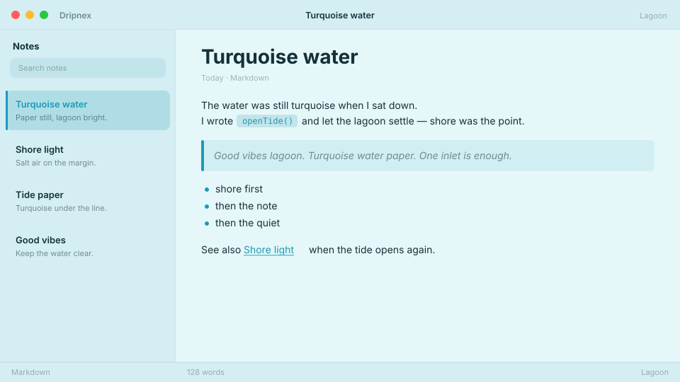

# Lagoon

Good vibes lagoon. Turquoise water paper.



```
dripnex/theme-lagoon
```

## Palette

The chips live in [palette.html](palette.html) — open it in a browser. GitHub won’t paint HTML swatches here, so the hex list is below.

| Name | Token | Color | What it’s for |
| --- | --- | --- | --- |
| Base | `--bg-base` | `#e6f7fa` | Window background |
| Surface | `--bg-surface` | `#d5eef3` | Sidebar and chrome |
| Elevated | `--bg-elevated` | `#f3fbfd` | Raised panels |
| Text | `--text-primary` | `#143038` | Headings and body |
| Muted | `--text-muted` | `#143038 · rgba(20, 48, 56, 0.52)` | Secondary copy |
| Accent | `--accent` | `#1a9bb5` | Selection and links |
| Active | `--status-active` | `#1a9bb5` | Active status |
| Dropped | `--status-dropped` | `#c45a5a` | Dropped status |

Pick it for the mood: Good vibes lagoon. Turquoise water paper.
